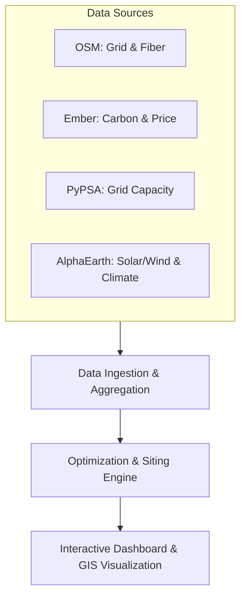

# Invertix: Data-Center Siting & Power

## 1. Challenge Statement

La crescita esponenziale dei modelli di intelligenza artificiale sta guidando un'ondata di costruzione di nuovi data center, con l'**elettricità** che rappresenta il vincolo vincolante principale. 

Trovare il sito ideale per un data center (*siting*) richiede un compromesso multidimensionale tra:
* **Prezzo dell'energia**: Costi operativi della rete elettrica e delle fonti dedicate.
* **Emissioni di carbonio (sostenibilità)**: Intensità di carbonio dell'energia consumata ($gCO_2/kWh$).
* **Congestione della rete elettrica**: Disponibilità e stabilità della rete di trasmissione per evitare sovraccarichi o interruzioni.
* **Connettività**: Latenza e vicinanza alle infrastrutture di fibra ottica esistenti.

L'obiettivo della challenge è costruire uno strumento decisionale o un modello per supportare la scelta di **dove costruire** un data center e **come alimentarlo** in modo ottimale.

---

## 2. Obiettivi Chiave (Worth Exploring)

* **Raccomandazione della Posizione**: Consigliare le migliori posizioni per un data center di una data dimensione (in MW) spiegando i relativi trade-off.
* **Pianificazione del Supply Mix**: Progettare un mix energetico ottimale tra la rete elettrica (*grid*), contratti PPA (*Power Purchase Agreement*) a lungo termine e generazione locale (*on-site* come solare, eolico e batterie) minimizzando costi e impatto ambientale.
* **Visualizzazione Multilayer**: Sovrapporre dati di capacità della rete, prezzi, intensità di carbonio e congestione per identificare chiaramente i siti ottimali rispetto a quelli svantaggiosi.

---

## 3. Risorse e Data Source Principali

Ecco l'elenco delle informazioni fornite per la challenge, i link per reperirle e come possono essere integrate nel nostro progetto:

### A. PyPSA-Eur
* **Link ufficiale**: [GitHub - PyPSA/pypsa-eur](https://github.com/PyPSA/pypsa-eur)
* **Descrizione**: Un modello open-source di ottimizzazione per la rete di trasmissione elettrica europea.
* **Come usarlo**:
  * Consente di simulare i flussi di carico e la capacità di trasmissione della rete.
  * Fornisce stime sui colli di bottiglia e sulla congestione della rete (nodi sovraccarichi).
  * Utile per calcolare i prezzi zonali dell'elettricità e simulare l'impatto di un nuovo carico massiccio (il data center) sulla rete locale.

### B. Ember Data
* **Link ufficiale**: [Ember Climate Data & Insights](https://ember-climate.org/data/)
* **Descrizione**: Database globale contenente serie storiche e dati in tempo reale su generazione elettrica, capacità installata, emissioni di carbonio e prezzi dell'elettricità a livello nazionale ed europeo.
* **Come usarlo**:
  * Estrarre l'intensità di carbonio storica e attuale della rete elettrica del paese o della regione target.
  * Valutare il mix energetico esistente (es. quota di rinnovabili vs combustibili fossili) per stimare l'impronta di carbonio di base.
  * Fornire i dati storici sui prezzi per addestrare o calibrare i nostri modelli di costo.

### C. OpenStreetMap (OSM)
* **Link ufficiale**: [OpenStreetMap](https://www.openstreetmap.org/)
* **Descrizione**: Database cartografico collaborativo e open-source del mondo intero.
* **Come usarlo**:
  * Utilizzare API come **Overpass API** per estrarre le coordinate geografiche di elementi infrastrutturali chiave:
    * Linee elettriche ad alta tensione (`power=line`).
    * Sottostazioni elettriche (`power=substation`).
    * Centrali elettriche esistenti (`power=generator`).
    * Data center esistenti e nodi di fibra ottica/telecomunicazioni.
  * Consente di calcolare la distanza fisica tra un potenziale sito e la rete elettrica/fibra più vicina, parametro cruciale per stimare i costi di allacciamento.

### D. IEA Energy & AI
* **Link ufficiale**: [IEA - Energy and AI Report & Tracking](https://www.iea.org/reports/energy-and-ai)
* **Descrizione**: Analisi e proiezioni dettagliate dell'International Energy Agency sull'impatto energetico dell'IA e dei data center sul consumo elettrico globale.
* **Come usarlo**:
  * Definire i parametri operativi del data center: PUE (*Power Usage Effectiveness*), quota di energia dedicata al calcolo (CPU/GPU) vs raffreddamento (cooling), e profili di carico tipici dell'IA (es. picchi durante il training di modelli LLM).
  * Utilizzare le proiezioni di crescita IEA per scenari futuri di stress-test sul sistema elettrico regionale.

### E. Google AlphaEarth
* **Link ufficiale / Riferimento**: [Google DeepMind AlphaEarth Foundations](https://deepmind.google/discover/blog/alphaearth-foundations/) & [Google Earth Engine](https://earthengine.google.com/)
* **Descrizione**: Modello di fondazione geospatial AI sviluppato da Google DeepMind che codifica dati di osservazione della terra (satellite, meteo, copertura del suolo, radiazioni solari) in embeddings pixel a 10m di risoluzione.
* **Come usarlo**:
  * Estrarre dati ambientali storici come irraggiamento solare medio e velocità del vento per valutare l'efficienza della generazione rinnovabile on-site.
  * Ricercare per similarità geografica siti adatti ad ospitare grandi infrastrutture industriali (basso rischio idrogeologico, temperature medie basse per ridurre i costi di raffreddamento).

---

## 4. Architettura Concettuale della Soluzione

Per risolvere la challenge, lo sviluppo può essere suddiviso in tre moduli principali:

1. **Data Ingestion & Aggregation**: Script Python per raccogliere ed elaborare le informazioni da OSM, Ember e PyPSA per i paesi europei selezionati, creando una griglia geografica raster o vettoriale dotata di attributi (prezzo medio, $gCO_2/kWh$, distanza dalla griglia ad alta tensione, potenziale solare/eolico).
2. **Optimization & Siting Engine**: Un algoritmo multicriterio (MCDA) che accetta in input la taglia del data center ($MW$) e i pesi preferenziali dell'utente (es. *massima sostenibilità* vs *minimo costo*). Inoltre, implementa un modello di ottimizzazione lineare (LP) per calcolare la combinazione ottimale di accumulo a batterie, pannelli solari in loco e PPAs di supporto.
3. **Interactive Dashboard & GIS Visualization**: Un'applicazione web (HTML, CSS moderno e Javascript con librerie come Leaflet.js o Maplibre GL) che visualizza i layer geografici in modo interattivo e permette all'utente di simulare scenari di siting in tempo reale.
